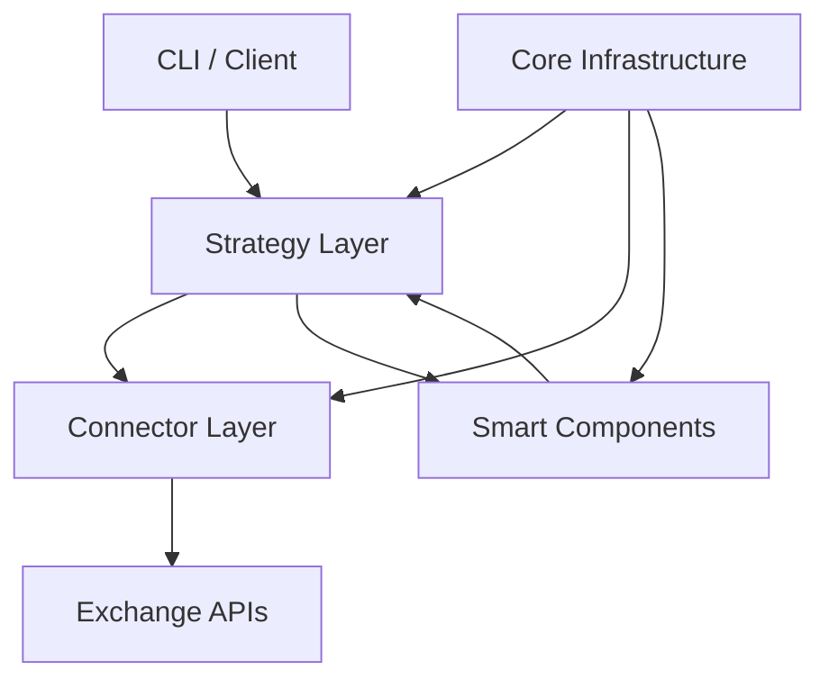
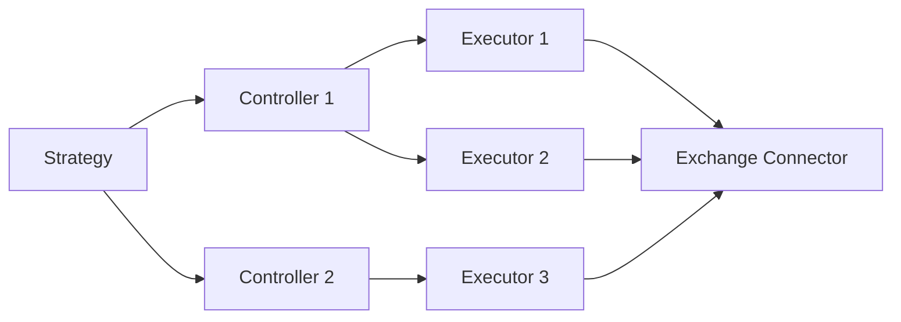
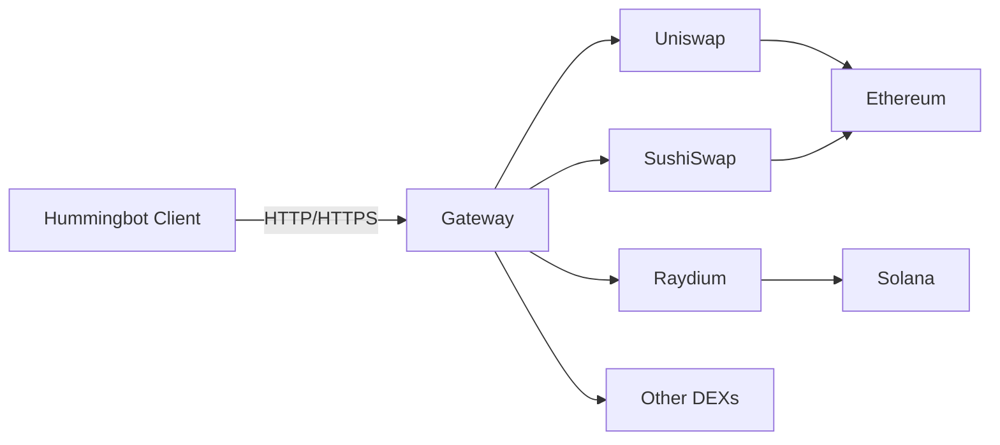
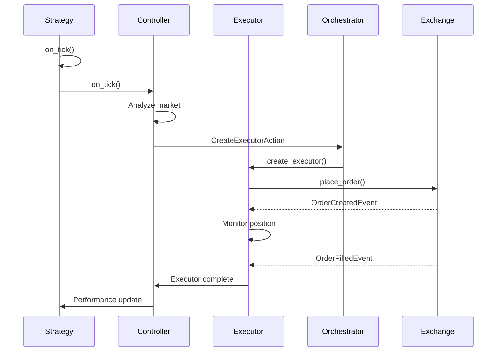

Hummingbot is built with a modular, event-driven architecture that separates concerns into distinct layers. This design allows developers to build sophisticated trading strategies by composing reusable components.

## High-Level Architecture

The Hummingbot codebase follows a layered architecture:



## Directory Structure

The main `hummingbot/` directory is organized as follows:

```
hummingbot/
├── client/              # CLI interface and user interaction
├── connector/           # Exchange connectors
│   ├── derivative/      # Perpetual/futures connectors
│   ├── exchange/        # Spot exchange connectors
│   ├── gateway/         # Gateway DEX connectors
│   ├── other/           # Misc connectors
│   ├── test_support/    # Testing utilities for connectors
│   └── utilities/       # Helper functions for connectors
├── core/                # Core infrastructure
│   ├── api_throttler/   # Rate limiting mechanism
│   ├── cpp/             # High-performance C++ data types
│   ├── data_type/       # Core data structures
│   ├── event/           # Event system and event types
│   ├── gateway/         # Gateway middleware components
│   ├── management/      # Console and diagnostic tools
│   ├── rate_oracle/     # Exchange rate data sources
│   ├── utils/           # Utility functions and bot plugins
│   └── web_assistant/   # HTTP/WebSocket helpers
├── data_feed/           # Price feeds (CoinCap, etc.)
├── logger/              # Logging infrastructure
├── model/               # Database models and market data structures
├── notifier/            # Notification service connectors
├── remote_iface/        # Remote interfaces (MQTT, etc.)
├── strategy/            # Built-in strategies (legacy)
├── strategy_v2/         # V2 Strategy Framework
│   ├── backtesting/     # Backtesting engine and simulators
│   ├── controllers/     # Controller base classes
│   ├── executors/       # Executor implementations
│   ├── models/          # Data models for V2 framework
│   └── utils/           # V2 utility functions
├── templates/           # Configuration file templates
└── user/                # User-specific data (balances, etc.)
```

<Info>
This structure is documented in `hummingbot/README.md:6-55` and represents the main organization of the Hummingbot framework.
</Info>

## Core Components

### 1. Connectors

Connectors standardize communication with different exchanges, abstracting REST and WebSocket API interfaces.

<Accordion title="Connector Types">
**CLOB CEX** (`connector/exchange/`):
- Centralized exchanges with order books
- Examples: Binance, Coinbase, OKX, KuCoin
- Connect via API keys
- Both spot (`binance`) and perpetual (`binance_perpetual`) variants

**CLOB DEX** (`connector/exchange/` with DEX implementations):
- Decentralized order book exchanges
- Examples: dYdX, Hyperliquid, Injective, Vertex
- Connect via wallet keys
- On-chain settlement

**AMM DEX** (`connector/gateway/`):
- Automated Market Maker protocols
- Examples: Uniswap, SushiSwap, Raydium, PancakeSwap
- Connect via Gateway middleware
- Three sub-types: Router, AMM, CLMM
</Accordion>

**Key Connector Methods:**

```python
class ConnectorBase:
    # Get current price
    def get_price_by_type(self, trading_pair: str, price_type: PriceType)
    
    # Place orders
    def buy(self, trading_pair: str, amount: Decimal, order_type: OrderType, price: Decimal)
    def sell(self, trading_pair: str, amount: Decimal, order_type: OrderType, price: Decimal)
    
    # Cancel orders
    def cancel(self, trading_pair: str, order_id: str)
    
    # Get balances
    def get_balance(self, currency: str) -> Decimal
    
    # Budget validation
    budget_checker.adjust_candidates(candidates: List[OrderCandidate])
```

### 2. Event System

Hummingbot uses an event-driven architecture for asynchronous operations:

```python
# Core events in core/event/events.py
class OrderFilledEvent:
    """Triggered when an order is filled"""
    trading_pair: str
    trade_type: TradeType
    price: Decimal
    amount: Decimal
    timestamp: float

class BuyOrderCreatedEvent:
    """Triggered when a buy order is created"""
    
class SellOrderCreatedEvent:
    """Triggered when a sell order is created"""
    
class OrderCancelledEvent:
    """Triggered when an order is cancelled"""
```

Strategies can override event handlers:

```python
class MyStrategy(StrategyV2Base):
    def did_fill_order(self, event: OrderFilledEvent):
        # React to filled orders
        pass
    
    def did_create_buy_order(self, event: BuyOrderCreatedEvent):
        # React to created orders
        pass
```

### 3. Data Types

Core data structures in `core/data_type/`:

- **OrderCandidate**: Proposed order before placement
- **TradeType**: Enum for BUY/SELL
- **OrderType**: LIMIT, MARKET, LIMIT_MAKER
- **PriceType**: MidPrice, BestBid, BestAsk, LastTrade
- **MarketDict**: Dictionary mapping exchanges to trading pairs

### 4. Strategy Base Classes

Two main strategy frameworks:

<CodeGroup>
```python Legacy Strategies (strategy/)
class StrategyBase:
    """Base class for legacy strategies"""
    # Examples: pure_market_making, cross_exchange_market_making
    # Monolithic, less modular
```

```python V2 Strategies (strategy_v2/)
class StrategyV2Base:
    """Base class for V2 strategies with controllers"""
    # Uses Controllers and Executors
    # More modular and composable
    
    def on_tick(self):
        """Called every tick (typically 1 second)"""
        pass
```
</CodeGroup>

## Strategy V2 Framework

The V2 framework introduces a **Controller-Executor** pattern for building advanced strategies:



### Controllers

Controllers implement high-level trading logic and manage executors.

**Base Classes:**

- `ControllerBase`: Generic controller foundation
- `DirectionalTradingControllerBase`: For trend-following strategies
- `MarketMakingControllerBase`: For market-making strategies

**Example Controller** (`controllers/directional_trading/dman_v3.py`):

```python
class DManV3Controller(DirectionalTradingControllerBase):
    """
    Dynamic Market Making controller using Bollinger Bands
    and DCA (Dollar Cost Averaging) executors
    """
    
    def __init__(self, config: DManV3ControllerConfig, *args, **kwargs):
        super().__init__(config, *args, **kwargs)
        self.config = config
    
    def on_tick(self):
        # Analyze market conditions
        candles = self.get_candles()
        bb_bands = self.calculate_bollinger_bands(candles)
        
        # Determine signal
        if self.should_enter_long(bb_bands):
            # Create DCA executor for long position
            executor_config = self.create_dca_config(TradeType.BUY)
            self.create_executor(executor_config)
        
        elif self.should_enter_short(bb_bands):
            # Create DCA executor for short position
            executor_config = self.create_dca_config(TradeType.SELL)
            self.create_executor(executor_config)
```

**Available Controllers** (in `controllers/`):

<CardGroup cols={2}>
  <Card title="Market Making">
    - `pmm_simple`: Simple PMM with configurable spreads
    - `pmm_dynamic`: Dynamic spread adjustment
    - `dman_maker_v2`: Advanced market making with indicators
  </Card>
  
  <Card title="Directional Trading">
    - `dman_v3`: Bollinger Bands + DCA
    - `bollinger_v1/v2`: Bollinger-based entries
    - `macd_bb_v1`: MACD + Bollinger strategy
    - `supertrend_v1`: Supertrend indicator
  </Card>
</CardGroup>

### Executors

Executors handle order placement, monitoring, and closing logic for specific trading patterns.

**Available Executors** (`strategy_v2/executors/`):

<AccordionGroup>
  <Accordion title="Position Executor">
    Manages a directional position with take-profit and stop-loss.
    
    ```python
    from hummingbot.strategy_v2.executors.position_executor.data_types import PositionExecutorConfig, TrailingStop
    
    config = PositionExecutorConfig(
        timestamp=time.time(),
        connector_name="binance",
        trading_pair="ETH-USDT",
        side=TradeType.BUY,
        entry_price=Decimal("2500"),
        amount=Decimal("0.1"),
        take_profit=Decimal("0.02"),  # 2% profit target
        stop_loss=Decimal("0.01"),    # 1% stop loss
        trailing_stop=TrailingStop(
            activation_price=Decimal("0.01"),
            trailing_delta=Decimal("0.005")
        )
    )
    ```
  </Accordion>
  
  <Accordion title="DCA Executor">
    Dollar Cost Averaging with multiple entry levels.
    
    ```python
    from hummingbot.strategy_v2.executors.dca_executor.data_types import DCAExecutorConfig, DCAMode
    
    config = DCAExecutorConfig(
        timestamp=time.time(),
        connector_name="binance",
        trading_pair="BTC-USDT",
        side=TradeType.BUY,
        amounts=[Decimal("0.01"), Decimal("0.02"), Decimal("0.03")],
        prices=[Decimal("40000"), Decimal("39000"), Decimal("38000")],
        mode=DCAMode.MAKER,  # or DCAMode.TAKER
        take_profit=Decimal("0.03"),
        stop_loss=Decimal("0.02")
    )
    ```
  </Accordion>
  
  <Accordion title="Grid Executor">
    Grid trading with multiple buy/sell levels.
    
    Automatically creates a grid of orders above and below current price.
  </Accordion>
  
  <Accordion title="TWAP Executor">
    Time-Weighted Average Price execution.
    
    Splits a large order into smaller chunks executed over time.
  </Accordion>
  
  <Accordion title="Arbitrage Executor">
    Cross-exchange arbitrage between two venues.
    
    Monitors price differences and executes when profitable.
  </Accordion>
  
  <Accordion title="XEMM Executor">
    Cross-Exchange Market Making.
    
    Makes markets on one exchange while hedging on another.
  </Accordion>
</AccordionGroup>

### Executor Orchestrator

The `ExecutorOrchestrator` manages the lifecycle of executors:

```python
class ExecutorOrchestrator:
    def execute_actions(self, actions: List[ExecutorAction]):
        """Process create/stop executor actions"""
        
    def execute_action(self, action: ExecutorAction):
        if isinstance(action, CreateExecutorAction):
            self.create_executor(action)
        elif isinstance(action, StopExecutorAction):
            self.stop_executor(action)
    
    def create_executor(self, action: CreateExecutorAction):
        """Instantiate and start an executor"""
        
    def stop_executor(self, action: StopExecutorAction):
        """Stop and clean up an executor"""
```

## Complete V2 Strategy Example

Here's how controllers and executors work together in `scripts/v2_with_controllers.py`:

```python
class V2WithControllers(StrategyV2Base):
    def __init__(self, connectors: Dict[str, ConnectorBase], config: V2WithControllersConfig):
        super().__init__(connectors, config)
        self.config = config
        # Controllers are loaded from config.controllers_config
    
    def on_tick(self):
        super().on_tick()  # Updates controllers and executors
        
        if not self._is_stop_triggered:
            self.check_manual_kill_switch()
            self.control_max_drawdown()
            self.send_performance_report()
    
    def control_max_drawdown(self):
        """Stop controllers that exceed max drawdown"""
        for controller_id, controller in self.controllers.items():
            controller_pnl = self.get_performance_report(controller_id).global_pnl_quote
            
            if self.is_drawdown_exceeded(controller_pnl):
                controller.stop()
                # Stop executors that haven't placed orders yet
                self.executor_orchestrator.execute_actions([
                    StopExecutorAction(controller_id=controller_id, executor_id=executor.id)
                    for executor in self.get_non_trading_executors(controller_id)
                ])
```

<Info>
The V2 framework is defined in `hummingbot/strategy_v2/` and represents the modern approach to building Hummingbot strategies. See `scripts/v2_with_controllers.py:1-100` for a complete implementation.
</Info>

## Backtesting

The V2 framework includes backtesting capabilities:

```python
from hummingbot.strategy_v2.backtesting.backtesting_engine_base import BacktestingEngineBase

class MyBacktester(BacktestingEngineBase):
    def run_backtest(self, start_time: int, end_time: int):
        # Load historical candle data
        candles = self.load_candles(start_time, end_time)
        
        # Simulate strategy execution
        for candle in candles:
            self.process_tick(candle)
        
        # Generate performance report
        return self.get_performance_metrics()
```

Executor simulators (`strategy_v2/backtesting/executors_simulator/`) allow testing without live trading.

## Gateway Architecture

For DEX trading, Hummingbot uses **Gateway**, a TypeScript middleware:



- **Repository**: [github.com/hummingbot/gateway](https://github.com/hummingbot/gateway)
- **Protocol**: REST API (HTTP in dev mode, HTTPS in production)
- **Purpose**: Standardize interactions with AMM/CLMM DEXs across different blockchains

## Data Flow

Typical data flow for a V2 strategy:



## Configuration System

Strategies use Pydantic models for type-safe configuration:

```python
from pydantic import Field
from hummingbot.strategy.strategy_v2_base import StrategyV2ConfigBase

class MyStrategyConfig(StrategyV2ConfigBase):
    script_file_name: str = "my_strategy.py"
    controllers_config: List[str] = ["pmm_simple", "dman_v3"]
    
    exchange: str = Field("binance", prompt="Enter exchange: ")
    trading_pair: str = Field("BTC-USDT", prompt="Enter trading pair: ")
    order_amount: Decimal = Field(Decimal("0.01"), prompt="Enter order amount: ")
    
    def update_markets(self, markets: MarketDict) -> MarketDict:
        """Register required markets"""
        markets[self.exchange] = markets.get(self.exchange, set()) | {self.trading_pair}
        return markets
```

Configurations are saved to `conf/scripts/*.yml`.

## Performance Optimization

Hummingbot uses several techniques for performance:

1. **Cython**: Critical paths compiled to C++ (`core/cpp/`, `.pyx` files)
2. **Event-driven**: Asynchronous I/O with asyncio
3. **Budget checking**: Pre-validation of orders before placement
4. **API throttling**: Rate limiting to prevent exchange bans (`core/api_throttler/`)
5. **Connection pooling**: Reuse WebSocket connections

## Next Steps

<CardGroup cols={2}>
  <Card title="Build a Controller" icon="gears" href="/strategies/custom-controller">
    Create your own controller for custom strategy logic
  </Card>
  
  <Card title="Exchange Connectors" icon="plug" href="/connectors">
    Learn how to use and develop exchange connectors
  </Card>
  
  <Card title="Example Strategies" icon="book-open" href="/strategies/examples">
    Explore real-world strategy implementations
  </Card>
  
  <Card title="Backtesting Guide" icon="chart-line" href="/backtesting">
    Test strategies with historical data
  </Card>
</CardGroup>

<Tip>
The modular V2 architecture allows you to mix and match controllers and executors. You can run multiple controllers simultaneously in a single strategy, each managing different trading pairs or using different logic.
</Tip>
