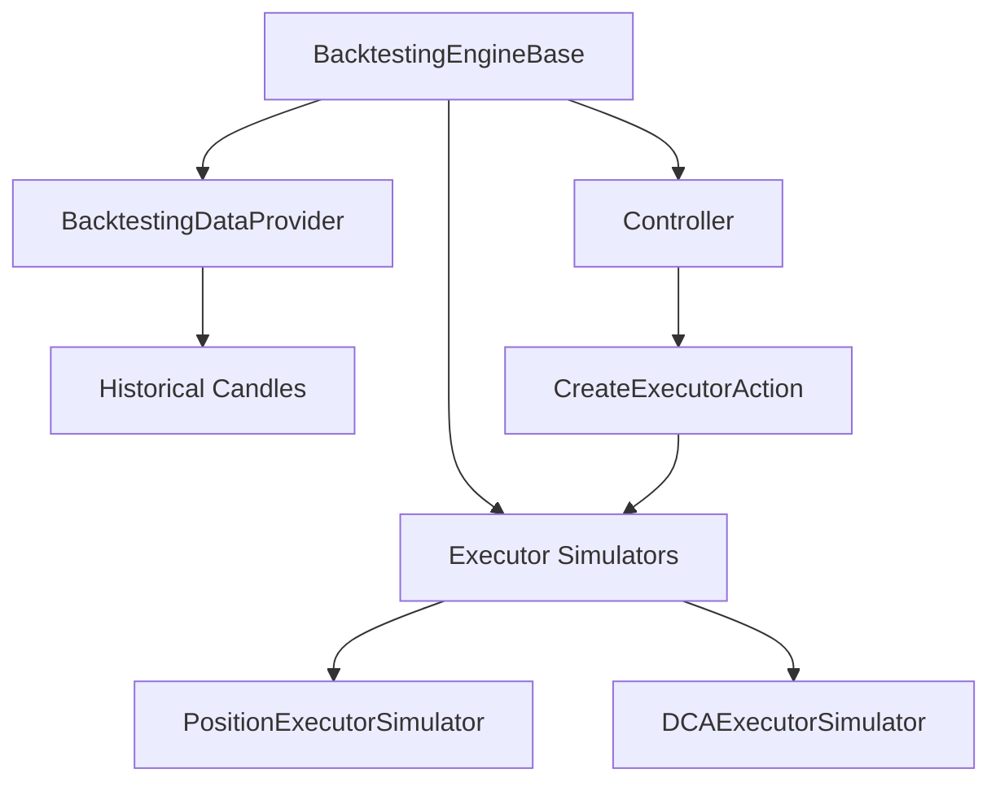

## Overview

Backtesting allows you to validate V2 strategies and controllers using historical market data. This helps you:

- **Validate strategy logic** before deploying with real funds
- **Optimize parameters** to find best-performing configurations
- **Understand risk characteristics** like drawdown and win rate
- **Compare strategies** objectively with historical data

<Warning>
Backtesting results don't guarantee future performance. Real trading involves slippage, latency, and market conditions that backtesting can't fully simulate.
</Warning>

## Architecture

The backtesting system simulates the complete V2 framework:



**Components**:
- **BacktestingEngineBase**: Main orchestrator for backtesting runs
- **BacktestingDataProvider**: Provides historical candles and market data
- **Executor Simulators**: Simulate executor behavior without real orders

## BacktestingEngineBase

The core class for running backtests.

**Source**: `strategy_v2/backtesting/backtesting_engine_base.py:32`

### Basic Usage

```python
from hummingbot.strategy_v2.backtesting.backtesting_engine_base import BacktestingEngineBase
from datetime import datetime

# Create engine
engine = BacktestingEngineBase()

# Load controller config from YAML
config = engine.get_controller_config_instance_from_yml(
    config_path="my_controller.yml"
)

# Run backtest
start_time = int(datetime(2024, 1, 1).timestamp())
end_time = int(datetime(2024, 2, 1).timestamp())

results = await engine.run_backtesting(
    controller_config=config,
    start=start_time,
    end=end_time,
    backtesting_resolution="1m",
    trade_cost=0.0006  # 0.06% per trade
)
```

### Configuration

<CodeGroup>
```yaml Controller Config
# controllers/my_controller.yml
controller_type: directional_trading
controller_name: dman_v3
id: backtest_001
connector_name: binance
trading_pair: ETH-USDT
total_amount_quote: 100

# Strategy parameters
bb_length: 100
bb_std: 2.0
interval: 3m
dca_spreads: "0.001,0.018,0.15,0.25"
```

```python From Dict
config_dict = {
    "controller_type": "directional_trading",
    "controller_name": "dman_v3",
    "connector_name": "binance",
    "trading_pair": "ETH-USDT",
    "total_amount_quote": 100,
    "bb_length": 100,
    "bb_std": 2.0,
    "interval": "3m",
}

config = BacktestingEngineBase.get_controller_config_instance_from_dict(
    config_data=config_dict
)
```
</CodeGroup>

## Running Backtests

### Step-by-Step Process

<Steps>
  <Step title="Prepare Controller Configuration">
    Create a YAML config file or config dictionary with your strategy parameters.
    
    ```yaml
    controller_type: directional_trading
    controller_name: dman_v3
    connector_name: binance
    trading_pair: BTC-USDT
    total_amount_quote: 1000
    # ... strategy parameters
    ```
  </Step>
  
  <Step title="Initialize Backtesting Engine">
    ```python
    from hummingbot.strategy_v2.backtesting.backtesting_engine_base import BacktestingEngineBase
    
    engine = BacktestingEngineBase()
    ```
  </Step>
  
  <Step title="Load Configuration">
    ```python
    config = engine.get_controller_config_instance_from_yml(
        config_path="dman_v3_btc.yml"
    )
    ```
  </Step>
  
  <Step title="Define Time Range">
    ```python
    from datetime import datetime
    
    start = int(datetime(2024, 1, 1).timestamp())
    end = int(datetime(2024, 3, 1).timestamp())  # 2 months
    ```
  </Step>
  
  <Step title="Run Backtest">
    ```python
    results = await engine.run_backtesting(
        controller_config=config,
        start=start,
        end=end,
        backtesting_resolution="1m",
        trade_cost=0.0006
    )
    ```
  </Step>
  
  <Step title="Analyze Results">
    ```python
    print(f"Total P&L: {results['total_pnl']}")
    print(f"Win Rate: {results['win_rate']}")
    print(f"Max Drawdown: {results['max_drawdown']}")
    ```
  </Step>
</Steps>

### Parameters

| Parameter | Type | Description | Default |
|-----------|------|-------------|----------|
| `controller_config` | `ControllerConfigBase` | Controller configuration | Required |
| `start` | `int` | Start timestamp (seconds) | Required |
| `end` | `int` | End timestamp (seconds) | Required |
| `backtesting_resolution` | `str` | Time resolution for simulation | `"1m"` |
| `trade_cost` | `float` | Trading fee (0.0006 = 0.06%) | `0.0006` |

## Data Requirements

### Historical Candles

Backtesting requires historical OHLCV data. The engine automatically downloads data if not cached.

**Supported Intervals**:
- `1m`, `3m`, `5m`, `15m`, `30m`
- `1h`, `2h`, `4h`, `6h`, `8h`, `12h`
- `1d`, `3d`, `1w`

**Data Sources**:
- Fetched from exchange APIs
- Cached locally in `data/candles/`
- Automatically updated when needed

### Trading Rules

The engine fetches exchange trading rules:
- Minimum order size
- Price/amount precision
- Tick size

This ensures backtesting matches real exchange constraints.

## Executor Simulation

Executors are simulated to replay their behavior without real orders.

### PositionExecutorSimulator

Simulates single position execution with triple barrier.

**Features**:
- Entry order simulation (MAKER or TAKER)
- Triple barrier monitoring (stop loss, take profit, time limit)
- Trailing stop simulation
- Slippage modeling
- Fee calculation

**Source**: `strategy_v2/backtesting/executors_simulator/position_executor_simulator.py`

### DCAExecutorSimulator

Simulates DCA (Dollar-Cost Averaging) execution.

**Features**:
- Multiple entry levels
- Activation bounds
- Single exit for all entries
- Dynamic spread calculation

**Source**: `strategy_v2/backtesting/executors_simulator/dca_executor_simulator.py`

### How Simulation Works

<Accordion title="Position Executor Simulation">
1. **Entry Phase**:
   - Places limit order at entry price
   - Checks if price touches entry level
   - Applies slippage if TAKER mode
   - Deducts trading fee

2. **Position Monitoring**:
   - Every candle, check price against barriers:
     - **Stop Loss**: Close if price moves against position
     - **Take Profit**: Close if profit target reached
     - **Time Limit**: Close if duration exceeded
     - **Trailing Stop**: Adjust stop dynamically

3. **Exit Phase**:
   - Simulate exit order
   - Calculate final P&L
   - Record close type and metrics
</Accordion>

<Accordion title="DCA Executor Simulation">
1. **Setup Phase**:
   - Create orders for each DCA level
   - Calculate price levels based on spreads

2. **Entry Phase**:
   - Monitor each level for activation
   - Apply activation bounds if configured
   - Fill orders as price touches levels

3. **Position Monitoring**:
   - Track average entry price across all levels
   - Monitor take profit/stop loss from average price
   - Apply trailing stop if configured

4. **Exit Phase**:
   - Close entire position at once
   - Calculate aggregate P&L
</Accordion>

## Results Analysis

Backtesting returns comprehensive performance metrics.

### Performance Metrics

```python
results = await engine.run_backtesting(...)

# Access metrics
metrics = results['performance_metrics']

print(f"Total Trades: {metrics['total_trades']}")
print(f"Winning Trades: {metrics['winning_trades']}")
print(f"Losing Trades: {metrics['losing_trades']}")
print(f"Win Rate: {metrics['win_rate']:.2%}")
print(f"Total P&L: {metrics['total_pnl']:.2f} USDT")
print(f"Total P&L %: {metrics['total_pnl_pct']:.2%}")
print(f"Max Drawdown: {metrics['max_drawdown']:.2%}")
print(f"Sharpe Ratio: {metrics['sharpe_ratio']:.2f}")
print(f"Avg Trade Duration: {metrics['avg_duration']:.0f}s")
```

### Executor-Level Results

```python
# Get all executor simulations
executors = results['executors']

for executor in executors:
    print(f"Executor {executor['id']}:")
    print(f"  Side: {executor['side']}")
    print(f"  Entry: {executor['entry_price']}")
    print(f"  Exit: {executor['exit_price']}")
    print(f"  P&L: {executor['net_pnl_quote']:.2f}")
    print(f"  Close Type: {executor['close_type']}")
    print(f"  Duration: {executor['duration']:.0f}s")
    print()
```

### Trade-by-Trade Analysis

```python
import pandas as pd

# Convert to DataFrame for analysis
trades_df = pd.DataFrame([
    {
        'timestamp': e['timestamp'],
        'side': e['side'],
        'entry_price': e['entry_price'],
        'exit_price': e['exit_price'],
        'pnl': e['net_pnl_quote'],
        'pnl_pct': e['net_pnl_pct'],
        'close_type': e['close_type'],
        'duration': e['duration'],
    }
    for e in executors
])

# Analyze
print(trades_df.describe())
print(f"\nBest Trade: {trades_df['pnl'].max():.2f}")
print(f"Worst Trade: {trades_df['pnl'].min():.2f}")
print(f"Avg Win: {trades_df[trades_df['pnl'] > 0]['pnl'].mean():.2f}")
print(f"Avg Loss: {trades_df[trades_df['pnl'] < 0]['pnl'].mean():.2f}")
```

## Parameter Optimization

Run multiple backtests to find optimal parameters.

### Grid Search Example

```python
import itertools
import pandas as pd
from datetime import datetime

# Define parameter ranges
bb_lengths = [50, 100, 150]
bb_stds = [1.5, 2.0, 2.5]
intervals = ["3m", "5m", "15m"]

# Run grid search
results = []

for bb_length, bb_std, interval in itertools.product(bb_lengths, bb_stds, intervals):
    # Create config
    config_dict = {
        "controller_type": "directional_trading",
        "controller_name": "dman_v3",
        "connector_name": "binance",
        "trading_pair": "ETH-USDT",
        "total_amount_quote": 100,
        "bb_length": bb_length,
        "bb_std": bb_std,
        "interval": interval,
    }
    
    config = BacktestingEngineBase.get_controller_config_instance_from_dict(config_dict)
    
    # Run backtest
    engine = BacktestingEngineBase()
    result = await engine.run_backtesting(
        controller_config=config,
        start=int(datetime(2024, 1, 1).timestamp()),
        end=int(datetime(2024, 3, 1).timestamp()),
        backtesting_resolution="1m",
        trade_cost=0.0006
    )
    
    # Store results
    results.append({
        'bb_length': bb_length,
        'bb_std': bb_std,
        'interval': interval,
        'total_pnl': result['performance_metrics']['total_pnl'],
        'win_rate': result['performance_metrics']['win_rate'],
        'max_drawdown': result['performance_metrics']['max_drawdown'],
        'sharpe_ratio': result['performance_metrics']['sharpe_ratio'],
    })

# Analyze results
df = pd.DataFrame(results)
df = df.sort_values('total_pnl', ascending=False)

print("Top 5 Configurations:")
print(df.head())

# Find best configuration
best = df.iloc[0]
print(f"\nBest Configuration:")
print(f"BB Length: {best['bb_length']}")
print(f"BB Std: {best['bb_std']}")
print(f"Interval: {best['interval']}")
print(f"Total P&L: {best['total_pnl']:.2f}")
print(f"Win Rate: {best['win_rate']:.2%}")
```

## Backtesting Scripts

While V2 controllers can be backtested, custom scripts cannot directly use the backtesting engine (they don't use controllers). However, you can:

### Convert Script Logic to Controller

1. Extract strategy logic from your script
2. Create a controller that implements the same logic
3. Backtest the controller
4. Use the validated parameters in your script

### Manual Simulation

Alternatively, write custom backtesting code for scripts:

```python
import pandas as pd
from decimal import Decimal

# Load historical data
df = pd.read_csv('eth_usdt_1m.csv')

# Initialize tracking
balance_quote = Decimal("1000")
balance_base = Decimal("0")
position = None
trades = []

# Simulate strategy
for i in range(len(df)):
    price = Decimal(str(df.iloc[i]['close']))
    
    # Your strategy logic
    if should_buy(df.iloc[:i+1]):
        if position is None:
            amount = balance_quote / price * Decimal("0.99")  # 1% fee
            balance_quote = 0
            balance_base = amount
            position = {'entry_price': price, 'amount': amount}
    
    elif should_sell(df.iloc[:i+1]) and position:
        balance_quote = balance_base * price * Decimal("0.99")
        balance_base = 0
        pnl = balance_quote - Decimal("1000")
        trades.append({'pnl': pnl, 'entry': position['entry_price'], 'exit': price})
        position = None

# Analyze
print(f"Total P&L: {balance_quote - Decimal('1000')}")
print(f"Total Trades: {len(trades)}")
```

## Best Practices

<AccordionGroup>
  <Accordion title="Use Realistic Fees">
    Always include trading fees in backtests:
    ```python
    # Typical exchange fees
    trade_cost=0.0006  # Binance maker/taker
    trade_cost=0.001   # Higher for some exchanges
    ```
  </Accordion>
  
  <Accordion title="Avoid Overfitting">
    - Test on different time periods (in-sample vs out-of-sample)
    - Don't optimize on the same data you'll evaluate on
    - Use walk-forward analysis
    - Keep parameter ranges reasonable
  </Accordion>
  
  <Accordion title="Account for Slippage">
    Backtesting assumes you get exact prices. Real trading has slippage:
    - MAKER orders: Better prices (negative slippage)
    - TAKER orders: Worse prices (positive slippage)
    - Set realistic `trade_cost` to account for this
  </Accordion>
  
  <Accordion title="Validate with Paper Trading">
    After backtesting:
    1. Deploy on paper trading exchange
    2. Run for at least a week
    3. Compare results to backtest expectations
    4. Only then consider live trading
  </Accordion>
  
  <Accordion title="Monitor Multiple Metrics">
    Don't just optimize for total P&L:
    - **Win Rate**: Consistency indicator
    - **Max Drawdown**: Risk measure
    - **Sharpe Ratio**: Risk-adjusted returns
    - **Avg Duration**: Capital efficiency
  </Accordion>
</AccordionGroup>

## Limitations

Backtesting has inherent limitations:

<Warning>
**What Backtesting Cannot Capture:**

- **Order Book Dynamics**: Assumes you get filled at limit price
- **Latency**: Real trading has network delays
- **Market Impact**: Large orders move prices
- **Changing Conditions**: Markets evolve over time
- **Black Swan Events**: Rare extreme events
- **Exchange Issues**: Downtime, bugs, rate limits
</Warning>

Use backtesting as one tool among many:
1. Backtest for initial validation
2. Paper trade for real-world testing
3. Start with small capital
4. Monitor and adjust continuously

## Example: Complete Workflow

```python
import asyncio
from hummingbot.strategy_v2.backtesting.backtesting_engine_base import BacktestingEngineBase
from datetime import datetime

async def backtest_strategy():
    # 1. Load configuration
    engine = BacktestingEngineBase()
    config = engine.get_controller_config_instance_from_yml(
        config_path="dman_v3_eth.yml"
    )
    
    # 2. Define time range (3 months)
    start = int(datetime(2024, 1, 1).timestamp())
    end = int(datetime(2024, 4, 1).timestamp())
    
    # 3. Run backtest
    print("Running backtest...")
    results = await engine.run_backtesting(
        controller_config=config,
        start=start,
        end=end,
        backtesting_resolution="1m",
        trade_cost=0.0006
    )
    
    # 4. Display results
    metrics = results['performance_metrics']
    print("\n=== Backtest Results ===")
    print(f"Total P&L: {metrics['total_pnl']:.2f} USDT")
    print(f"Total P&L %: {metrics['total_pnl_pct']:.2%}")
    print(f"Total Trades: {metrics['total_trades']}")
    print(f"Win Rate: {metrics['win_rate']:.2%}")
    print(f"Max Drawdown: {metrics['max_drawdown']:.2%}")
    print(f"Sharpe Ratio: {metrics['sharpe_ratio']:.2f}")
    
    # 5. Analyze executors
    executors = results['executors']
    print(f"\n=== Trade Breakdown ===")
    print(f"Stop Loss: {sum(1 for e in executors if e['close_type'] == 'STOP_LOSS')}")
    print(f"Take Profit: {sum(1 for e in executors if e['close_type'] == 'TAKE_PROFIT')}")
    print(f"Time Limit: {sum(1 for e in executors if e['close_type'] == 'TIME_LIMIT')}")
    
    return results

# Run
if __name__ == "__main__":
    results = asyncio.run(backtest_strategy())
```

## Next Steps

<CardGroup cols={2}>
  <Card title="Controllers" icon="gamepad" href="/development/controllers">
    Build controllers that can be backtested
  </Card>
  <Card title="Executors" icon="play" href="/development/executors">
    Understand executor simulation
  </Card>
  <Card title="Strategy V2" icon="layer-group" href="/development/strategy-v2">
    Learn the complete V2 framework
  </Card>
  <Card title="Custom Scripts" icon="code" href="/development/custom-scripts">
    Simple strategies (manual backtesting)
  </Card>
</CardGroup>