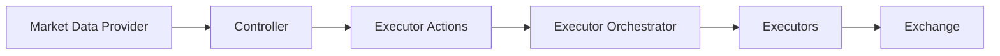

## Overview

Controllers are the "brain" of V2 strategies. They analyze market data, generate trading signals, and create executor actions without directly managing orders. This separation enables:

- **Reusability**: Use the same controller across multiple strategies
- **Testability**: Backtest controllers independently
- **Composability**: Combine multiple controllers in one strategy

## Architecture



## ControllerBase Class

All controllers inherit from `ControllerBase`, which extends `RunnableBase`.

### Source Reference

See `strategy_v2/controllers/controller_base.py:58` for the complete implementation.

### Configuration

```python
class ControllerConfigBase(BaseClientModel):
    id: str = Field(..., description="Unique identifier")
    controller_name: str
    controller_type: str = "generic"
    total_amount_quote: Decimal = Field(default=Decimal("100"))
    manual_kill_switch: bool = Field(default=False)
```

**Key Fields:**
- `id` - Unique identifier for this controller instance
- `controller_name` - Name matching the controller class module
- `total_amount_quote` - Budget allocated to this controller
- `manual_kill_switch` - Enable manual shutdown via config update

## Controller Types

Hummingbot provides specialized base classes for common strategy patterns:

<CardGroup cols={2}>
  <Card title="DirectionalTradingController" icon="arrow-trend-up">
    For trend-following and momentum strategies
  </Card>
  <Card title="MarketMakingController" icon="scale-balanced">
    For market-making and liquidity provision strategies
  </Card>
</CardGroup>

### DirectionalTradingControllerBase

Optimized for strategies that take directional positions based on market signals.

**Location**: `strategy_v2/controllers/directional_trading_controller_base.py`

**Features**:
- Position management for long/short trades
- Trend detection utilities
- Entry/exit signal generation

### MarketMakingControllerBase

Designed for strategies that provide liquidity on both sides of the order book.

**Location**: `strategy_v2/controllers/market_making_controller_base.py`

**Features**:
- Bid/ask spread management
- Inventory balancing
- Order refresh logic

## Building a Controller

<Steps>
  <Step title="Create Config Class">
    Define parameters for your controller:
    
    ```python
    from hummingbot.strategy_v2.controllers.directional_trading_controller_base import (
        DirectionalTradingControllerConfigBase
    )
    
    class MyControllerConfig(DirectionalTradingControllerConfigBase):
        controller_name: str = "my_controller"
        connector_name: str = Field("binance")
        trading_pair: str = Field("ETH-USDT")
        # Custom parameters
        signal_threshold: Decimal = Field(Decimal("0.02"))
    ```
  </Step>
  
  <Step title="Implement Controller Class">
    Create the controller logic:
    
    ```python
    from hummingbot.strategy_v2.controllers.directional_trading_controller_base import (
        DirectionalTradingControllerBase
    )
    
    class MyController(DirectionalTradingControllerBase):
        def __init__(self, config: MyControllerConfig, *args, **kwargs):
            super().__init__(config, *args, **kwargs)
            self.config = config
        
        async def update_processed_data(self):
            """Process market data and update internal state"""
            # Analyze candles, calculate indicators, etc.
            pass
        
        def determine_executor_actions(self) -> List[ExecutorAction]:
            """Generate trading actions based on signals"""
            actions = []
            # Generate buy/sell signals
            return actions
    ```
  </Step>
  
  <Step title="Add Candles Configuration">
    Define what market data your controller needs:
    
    ```python
    def __init__(self, config: MyControllerConfig, *args, **kwargs):
        super().__init__(config, *args, **kwargs)
        self.config = config
    
    @property
    def candles_configs(self) -> List[CandlesConfig]:
        return [
            CandlesConfig(
                connector=self.config.connector_name,
                trading_pair=self.config.trading_pair,
                interval="1m",
                max_records=500
            )
        ]
    ```
  </Step>
</Steps>

## Real-World Example: DMan V3

A sophisticated directional trading controller using Bollinger Bands and DCA.

**Source**: `controllers/directional_trading/dman_v3.py:1`

### Configuration

```python
class DManV3ControllerConfig(DirectionalTradingControllerConfigBase):
    controller_name: str = "dman_v3"
    
    # Candles configuration
    candles_connector: str = Field(default=None)
    candles_trading_pair: str = Field(default=None)
    interval: str = Field(default="3m")
    
    # Indicator parameters
    bb_length: int = Field(default=100)
    bb_std: float = Field(default=2.0)
    bb_long_threshold: float = Field(default=0.0)
    bb_short_threshold: float = Field(default=1.0)
    
    # Risk management
    trailing_stop: Optional[TrailingStop] = Field(default="0.015,0.005")
    dca_spreads: List[Decimal] = Field(default="0.001,0.018,0.15,0.25")
    dca_amounts_pct: List[Decimal] = Field(default=None)
    
    # Dynamic features
    dynamic_order_spread: bool = Field(default=None)
    dynamic_target: bool = Field(default=None)
```

<Accordion title="View Full DMan V3 Implementation Highlights">
```python
class DManV3Controller(DirectionalTradingControllerBase):
    async def update_processed_data(self):
        """Calculate Bollinger Bands and generate signals"""
        df = self.market_data_provider.get_candles_df(
            connector_name=self.candles_connector,
            trading_pair=self.candles_trading_pair,
            interval=self.config.interval
        )
        
        # Add Bollinger Bands
        df.ta.bbands(
            length=self.config.bb_length,
            std=self.config.bb_std,
            append=True
        )
        
        # Calculate position in BB channel
        current_price = df["close"].iloc[-1]
        bb_lower = df[f"BBL_{self.config.bb_length}_{self.config.bb_std}"].iloc[-1]
        bb_upper = df[f"BBU_{self.config.bb_length}_{self.config.bb_std}"].iloc[-1]
        
        self.bb_percentage = (current_price - bb_lower) / (bb_upper - bb_lower)
    
    def determine_executor_actions(self) -> List[ExecutorAction]:
        """Generate DCA executor actions based on BB signals"""
        if self.bb_percentage <= self.config.bb_long_threshold:
            # Generate LONG signal with DCA levels
            return self.create_dca_executor_action(side=TradeType.BUY)
        elif self.bb_percentage >= self.config.bb_short_threshold:
            # Generate SHORT signal
            return self.create_dca_executor_action(side=TradeType.SELL)
        return []
```
</Accordion>

## Lifecycle Methods

Controllers inherit the RunnableBase lifecycle. Key methods to override:

### async on_start()

Called once when the controller starts. Use for initialization:

```python
async def on_start(self):
    await super().on_start()
    # Load historical data
    await self.load_historical_candles()
    # Initialize indicators
    self.initialize_indicators()
```

### on_stop()

Called once when the controller stops. Use for cleanup:

```python
def on_stop(self):
    super().on_stop()
    # Save state
    self.save_performance_metrics()
    # Log final statistics
    self.logger().info(f"Controller stopped. Final PnL: {self.net_pnl}")
```

### async control_task()

Called every `update_interval` seconds. The main logic loop:

```python
async def control_task(self):
    # 1. Update market data
    await self.update_processed_data()
    
    # 2. Generate trading actions
    actions = self.determine_executor_actions()
    
    # 3. Send actions to executor orchestrator
    if actions and self.actions_queue:
        await self.actions_queue.put(actions)
```

## Working with Market Data

### Accessing Candles

```python
# Get candles as DataFrame
df = self.market_data_provider.get_candles_df(
    connector_name="binance",
    trading_pair="ETH-USDT",
    interval="1m",
    max_records=100
)

# Access OHLCV data
prices = df["close"]
volumes = df["volume"]
highs = df["high"]
```

### Calculating Indicators

Hummingbot includes `pandas_ta` for technical analysis:

```python
import pandas_ta as ta

# Add indicators to DataFrame
df.ta.sma(length=20, append=True)      # Simple Moving Average
df.ta.ema(length=50, append=True)      # Exponential Moving Average
df.ta.rsi(length=14, append=True)      # Relative Strength Index
df.ta.macd(append=True)                # MACD
df.ta.bbands(length=20, std=2, append=True)  # Bollinger Bands

# Access indicator values
sma_20 = df["SMA_20"].iloc[-1]  # Latest SMA value
rsi = df["RSI_14"].iloc[-1]     # Latest RSI value
```

### Getting Current Price

```python
# From candles
current_price = df["close"].iloc[-1]

# From order book (more accurate)
from hummingbot.core.data_type.common import PriceType

mid_price = self.market_data_provider.get_price_by_type(
    connector_name="binance",
    trading_pair="ETH-USDT",
    price_type=PriceType.MidPrice
)
```

## Generating Executor Actions

### Creating a Position Executor

```python
from hummingbot.strategy_v2.models.executor_actions import CreateExecutorAction
from hummingbot.strategy_v2.executors.position_executor.data_types import (
    PositionExecutorConfig,
    TripleBarrierConfig
)

def determine_executor_actions(self) -> List[ExecutorAction]:
    actions = []
    
    if self.should_enter_long():
        config = PositionExecutorConfig(
            timestamp=self.market_data_provider.time(),
            controller_id=self.config.id,
            connector_name=self.config.connector_name,
            trading_pair=self.config.trading_pair,
            side=TradeType.BUY,
            amount=Decimal("0.1"),
            triple_barrier_config=TripleBarrierConfig(
                stop_loss=Decimal("0.02"),      # 2% stop loss
                take_profit=Decimal("0.05"),    # 5% take profit
                time_limit=60 * 60              # 1 hour time limit
            )
        )
        
        actions.append(CreateExecutorAction(
            controller_id=self.config.id,
            executor_config=config
        ))
    
    return actions
```

### Creating a DCA Executor

```python
from hummingbot.strategy_v2.executors.dca_executor.data_types import (
    DCAExecutorConfig,
    DCAMode
)

def create_dca_action(self, side: TradeType) -> CreateExecutorAction:
    config = DCAExecutorConfig(
        timestamp=self.market_data_provider.time(),
        controller_id=self.config.id,
        connector_name=self.config.connector_name,
        trading_pair=self.config.trading_pair,
        side=side,
        amounts_quote=[Decimal("10"), Decimal("20"), Decimal("40")],
        spreads=[Decimal("0.001"), Decimal("0.002"), Decimal("0.003")],
        mode=DCAMode.MAKER,
        take_profit=Decimal("0.03"),
        stop_loss=Decimal("0.02"),
    )
    
    return CreateExecutorAction(
        controller_id=self.config.id,
        executor_config=config
    )
```

## Performance Monitoring

Controllers can track their own performance:

```python
class MyController(DirectionalTradingControllerBase):
    def get_custom_info(self) -> Dict:
        """Return custom metrics for monitoring"""
        return {
            "signal_strength": float(self.current_signal),
            "active_positions": len(self.active_executors),
            "bb_percentage": float(self.bb_percentage),
            "win_rate": self.calculate_win_rate(),
        }
```

Access from strategy:

```python
controller = self.controllers["controller_id"]
custom_info = controller.get_custom_info()
print(f"Signal strength: {custom_info['signal_strength']}")
```

## Configuration Management

### Loading from YAML

Controllers are typically configured via YAML files:

```yaml
controller_type: directional_trading
controller_name: dman_v3
connector_name: binance
trading_pair: ETH-USDT
total_amount_quote: 100
bb_length: 100
bb_std: 2.0
interval: 3m
```

Load in strategy config:

```python
class MyStrategyConfig(StrategyV2ConfigBase):
    controllers_config: List[str] = ["my_controller.yml"]
```

### Dynamic Updates

Controllers support runtime configuration updates:

```python
# Update via manual_kill_switch
controller.config.manual_kill_switch = True  # Will stop on next tick

# Update other parameters (if marked is_updatable)
controller.config.total_amount_quote = Decimal("200")
```

## Best Practices

<AccordionGroup>
  <Accordion title="Keep Controllers Stateless When Possible">
    Store state in executors, not controllers. Controllers should generate actions based on current market data, not maintain complex internal state.
  </Accordion>
  
  <Accordion title="Use Candles Efficiently">
    Request only the data you need:
    ```python
    CandlesConfig(
        connector="binance",
        trading_pair="ETH-USDT",
        interval="1m",
        max_records=100  # Don't request more than needed
    )
    ```
  </Accordion>
  
  <Accordion title="Handle Edge Cases">
    Always check for sufficient data before generating signals:
    ```python
    if len(df) < self.config.bb_length:
        self.logger().warning("Insufficient data for BB calculation")
        return []
    ```
  </Accordion>
  
  <Accordion title="Log Important Decisions">
    Make debugging easier with clear logging:
    ```python
    self.logger().info(
        f"LONG signal generated: BB%={self.bb_percentage:.2%}, "
        f"Threshold={self.config.bb_long_threshold}"
    )
    ```
  </Accordion>
</AccordionGroup>

## Testing Controllers

Controllers can be tested independently using the backtesting engine:

```python
from hummingbot.strategy_v2.backtesting.backtesting_engine_base import BacktestingEngineBase

engine = BacktestingEngineBase()
config = MyControllerConfig(
    id="test_1",
    connector_name="binance",
    trading_pair="ETH-USDT",
    # ... parameters
)

results = await engine.run_backtesting(
    controller_config=config,
    start=start_timestamp,
    end=end_timestamp,
    backtesting_resolution="1m"
)
```

See [Backtesting](/development/backtesting) for more details.

## Next Steps

<CardGroup cols={2}>
  <Card title="Executors" icon="play" href="/development/executors">
    Learn how executors handle order execution
  </Card>
  <Card title="Backtesting" icon="chart-line" href="/development/backtesting">
    Test your controllers with historical data
  </Card>
  <Card title="Strategy V2" icon="layer-group" href="/development/strategy-v2">
    Understand the complete V2 framework
  </Card>
  <Card title="Custom Scripts" icon="code" href="/development/custom-scripts">
    Simpler alternative for basic strategies
  </Card>
</CardGroup>