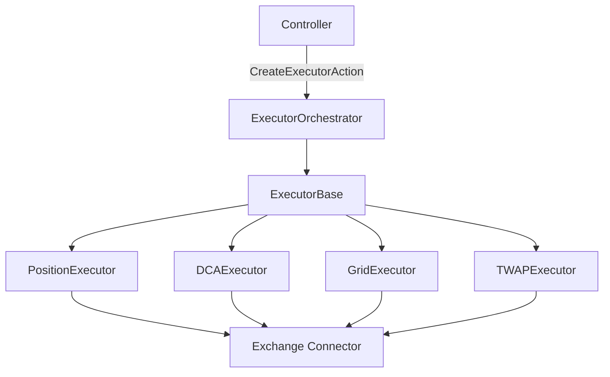
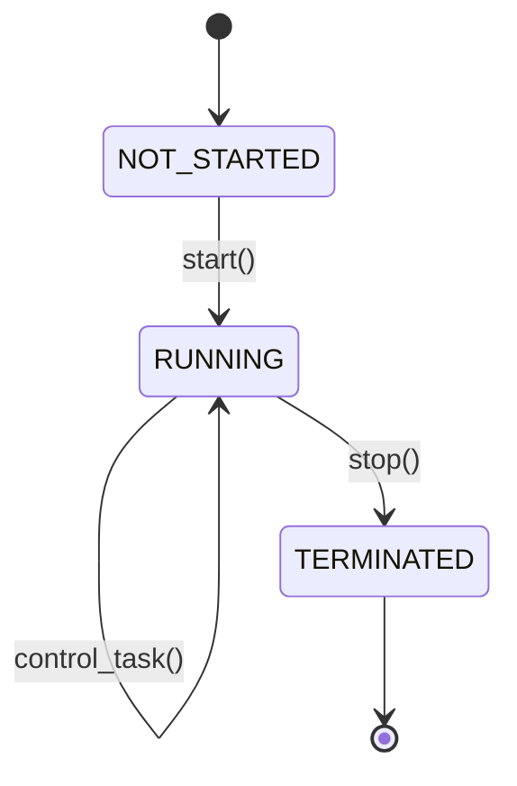

## Overview

Executors are the "hands" of V2 strategies. They handle all order-level operations:

- Placing and managing orders
- Tracking positions and P&L
- Implementing risk controls (stop loss, take profit, trailing stops)
- Responding to market events (fills, cancellations, failures)

While controllers decide **what** to trade, executors manage **how** trades are executed.

## Architecture



## ExecutorBase Class

All executors inherit from `ExecutorBase`, which extends `RunnableBase`.

**Source**: `strategy_v2/executors/executor_base.py:29`

### Key Features

<CardGroup cols={2}>
  <Card title="Lifecycle Management" icon="rotate">
    Start, stop, and status tracking
  </Card>
  <Card title="Event Handling" icon="bolt">
    React to order fills, cancellations, failures
  </Card>
  <Card title="P&L Tracking" icon="chart-line">
    Real-time profit/loss calculation
  </Card>
  <Card title="Risk Controls" icon="shield">
    Stop loss, take profit, time limits
  </Card>
</CardGroup>

### Initialization

```python
class ExecutorBase(RunnableBase):
    def __init__(
        self,
        strategy: StrategyV2Base,
        connectors: List[str],
        config: ExecutorConfigBase,
        update_interval: float = 0.5
    ):
        super().__init__(update_interval)
        self.config = config
        self._strategy = strategy
        self.connectors = {name: strategy.connectors[name] for name in connectors}
        self.close_type: Optional[CloseType] = None
```

## Executor Types

Hummingbot includes several built-in executor types:

### PositionExecutor

Manages individual positions with triple-barrier risk management.

**Use Cases**:
- Single entry/exit trades
- Trend-following positions
- Breakout strategies

**Key Features**:
- Triple barrier (stop loss, take profit, time limit)
- Trailing stop loss
- Both LONG and SHORT positions

**Location**: `strategy_v2/executors/position_executor/position_executor.py`

### DCAExecutor

Dollar-Cost Averaging executor with multiple entry levels.

**Use Cases**:
- Scaling into positions
- Volatility strategies
- Mean reversion

**Key Features**:
- Multiple entry orders at different price levels
- Configurable spreads and amounts
- Activation bounds (conditional orders)
- Single exit for all entries

**Location**: `strategy_v2/executors/dca_executor/`

### GridExecutor

Grid trading with multiple buy and sell levels.

**Use Cases**:
- Range-bound markets
- Market making
- Liquidity provision

**Key Features**:
- Symmetric or asymmetric grids
- Auto-rebalancing
- Configurable grid spacing

**Location**: `strategy_v2/executors/grid_executor/`

### TWAPExecutor

Time-Weighted Average Price execution.

**Use Cases**:
- Large order execution
- Minimizing market impact
- Scheduled buying/selling

**Key Features**:
- Split orders over time
- Configurable intervals
- MAKER or TAKER execution

**Location**: `strategy_v2/executors/twap_executor/`

### ArbitrageExecutor

Cross-exchange arbitrage execution.

**Use Cases**:
- CEX-DEX arbitrage
- Cross-exchange spread capture
- Funding rate arbitrage

**Location**: `strategy_v2/executors/arbitrage_executor/`

## Executor Lifecycle

### States

Executors progress through these states:



**RunnableStatus values**:
- `NOT_STARTED` - Created but not started
- `RUNNING` - Active, managing orders
- `TERMINATED` - Finished execution

### Properties

```python
# Check executor state
if executor.is_active:
    print("Executor is running")

if executor.is_trading:
    print("Executor has open positions")

if executor.is_closed:
    print("Executor finished")

# Get close reason
if executor.close_type == CloseType.TAKE_PROFIT:
    print("Closed with profit target")
elif executor.close_type == CloseType.STOP_LOSS:
    print("Closed by stop loss")
```

## Creating Executors

Executors are created through `CreateExecutorAction` from controllers:

### PositionExecutor Example

```python
from hummingbot.strategy_v2.models.executor_actions import CreateExecutorAction
from hummingbot.strategy_v2.executors.position_executor.data_types import (
    PositionExecutorConfig,
    TripleBarrierConfig,
    TrailingStop
)
from hummingbot.core.data_type.common import TradeType
from decimal import Decimal

# Create position executor config
config = PositionExecutorConfig(
    timestamp=self.current_timestamp,
    controller_id="my_controller",
    connector_name="binance",
    trading_pair="ETH-USDT",
    side=TradeType.BUY,
    amount=Decimal("0.1"),
    
    # Triple barrier risk management
    triple_barrier_config=TripleBarrierConfig(
        stop_loss=Decimal("0.02"),        # 2% stop loss
        take_profit=Decimal("0.05"),      # 5% take profit
        time_limit=3600,                   # 1 hour max duration
        trailing_stop=TrailingStop(
            activation_price=Decimal("0.02"),  # Activate after 2% profit
            trailing_delta=Decimal("0.01")     # Trail by 1%
        )
    ),
    
    # Execution strategy
    entry_price=Decimal("2000"),          # Limit order price
    leverage=Decimal("1"),                # No leverage
)

# Create action
action = CreateExecutorAction(
    controller_id="my_controller",
    executor_config=config
)

# Send to orchestrator (from controller)
if self.actions_queue:
    await self.actions_queue.put([action])
```

### DCAExecutor Example

```python
from hummingbot.strategy_v2.executors.dca_executor.data_types import (
    DCAExecutorConfig,
    DCAMode
)

config = DCAExecutorConfig(
    timestamp=self.current_timestamp,
    controller_id="my_controller",
    connector_name="binance",
    trading_pair="ETH-USDT",
    side=TradeType.BUY,
    
    # DCA levels
    amounts_quote=[
        Decimal("10"),   # Level 1: $10
        Decimal("20"),   # Level 2: $20
        Decimal("40"),   # Level 3: $40
        Decimal("80"),   # Level 4: $80
    ],
    spreads=[
        Decimal("0.005"),  # 0.5% below current price
        Decimal("0.010"),  # 1.0% below current price
        Decimal("0.020"),  # 2.0% below current price
        Decimal("0.040"),  # 4.0% below current price
    ],
    
    # Activation bounds (optional)
    activation_bounds=[
        Decimal("0.002"),  # Activate level 2 when price within 0.2%
        Decimal("0.005"),  # Activate level 3 when price within 0.5%
        Decimal("0.010"),  # Activate level 4 when price within 1.0%
    ],
    
    # Exit configuration
    mode=DCAMode.MAKER,
    take_profit=Decimal("0.03"),     # 3% profit target
    stop_loss=Decimal("0.05"),       # 5% stop loss
    time_limit=7200,                  # 2 hours max
    
    # Trailing stop (optional)
    trailing_stop=TrailingStop(
        activation_price=Decimal("0.02"),
        trailing_delta=Decimal("0.01")
    )
)
```

## P&L Tracking

Executors automatically track performance metrics:

### Accessing P&L

```python
# Get executor info
info = executor.executor_info

print(f"Net P&L: {info.net_pnl_quote} USDT")
print(f"Net P&L %: {info.net_pnl_pct * 100:.2f}%")
print(f"Fees paid: {info.cum_fees_quote} USDT")
print(f"Filled amount: {info.filled_amount_quote} USDT")
print(f"Status: {info.status}")
print(f"Close type: {info.close_type}")
```

### From Strategy

```python
# Get all executors for a controller
executors = self.get_executors_by_controller("controller_id")

total_pnl = sum(e.net_pnl_quote for e in executors)
active_count = sum(1 for e in executors if e.is_active)

print(f"Total P&L: {total_pnl}")
print(f"Active executors: {active_count}")
```

### Performance Reports

```python
# Get aggregated performance for a controller
report = self.get_performance_report("controller_id")

print(f"Global P&L: {report.global_pnl_quote}")
print(f"Realized P&L: {report.realized_pnl_quote}")
print(f"Unrealized P&L: {report.unrealized_pnl_quote}")
print(f"Total executors: {report.total_executors}")
print(f"Active executors: {report.active_executors}")
print(f"Closed executors: {report.closed_executors}")
```

## Event Handling

Executors respond to order events automatically:

### Override Event Methods

```python
class MyCustomExecutor(ExecutorBase):
    def process_order_created_event(
        self,
        event_tag: int,
        market: ConnectorBase,
        event: Union[BuyOrderCreatedEvent, SellOrderCreatedEvent]
    ):
        """Called when order is created"""
        self.logger().info(f"Order created: {event.order_id}")
    
    def process_order_filled_event(
        self,
        event_tag: int,
        market: ConnectorBase,
        event: OrderFilledEvent
    ):
        """Called when order fills (partial or complete)"""
        self.logger().info(
            f"Order filled: {event.amount} at {event.price}"
        )
        # Update position tracking
        self.filled_amount += event.amount
    
    def process_order_completed_event(
        self,
        event_tag: int,
        market: ConnectorBase,
        event: Union[BuyOrderCompletedEvent, SellOrderCompletedEvent]
    ):
        """Called when order fully fills"""
        self.logger().info(f"Order completed: {event.order_id}")
    
    def process_order_canceled_event(
        self,
        event_tag: int,
        market: ConnectorBase,
        event: OrderCancelledEvent
    ):
        """Called when order is cancelled"""
        self.logger().warning(f"Order cancelled: {event.order_id}")
    
    def process_order_failed_event(
        self,
        event_tag: int,
        market: ConnectorBase,
        event: MarketOrderFailureEvent
    ):
        """Called when order fails"""
        self.logger().error(
            f"Order failed: {event.order_id} - {event.error_message}"
        )
```

## Risk Management

### Triple Barrier

The most common risk management pattern:

```python
TripleBarrierConfig(
    stop_loss=Decimal("0.02"),      # Exit if price moves 2% against position
    take_profit=Decimal("0.05"),    # Exit if price moves 5% in favor
    time_limit=3600,                 # Exit after 1 hour regardless
)
```

The executor automatically:
1. Monitors price movement
2. Triggers exit when any barrier is hit
3. Sets `close_type` appropriately

### Trailing Stop

Lock in profits as price moves in your favor:

```python
TrailingStop(
    activation_price=Decimal("0.02"),  # Activate after 2% profit
    trailing_delta=Decimal("0.01")     # Trail by 1%
)
```

**Example**:
- Buy at $100
- Price reaches $102 (2% profit) → trailing stop activates at $101 (1% trail)
- Price reaches $105 → trailing stop moves to $104
- Price drops to $104 → position closes with 4% profit

### Early Stop

Manually stop an executor from the strategy:

```python
from hummingbot.strategy_v2.models.executor_actions import StopExecutorAction

# Stop specific executor
action = StopExecutorAction(
    executor_id="executor_123",
    controller_id="my_controller"
)

self.executor_orchestrator.execute_actions([action])
```

Or call directly on the executor:

```python
# Close position and stop executor
executor.early_stop(keep_position=False)

# Stop executor but keep position open
executor.early_stop(keep_position=True)
```

## Querying Executors

From your strategy, you can filter and query executors:

### Basic Queries

```python
# Get all executors
all_executors = self.get_all_executors()

# Get executors for specific controller
controller_executors = self.get_executors_by_controller("controller_id")

# Filter with lambda
active_executors = self.filter_executors(
    executors=all_executors,
    filter_func=lambda e: e.is_active
)

profitable_executors = self.filter_executors(
    executors=all_executors,
    filter_func=lambda e: e.net_pnl_quote > 0
)
```

### Advanced Filtering

```python
from hummingbot.strategy_v2.controllers.controller_base import ExecutorFilter
from hummingbot.core.data_type.common import TradeType

# Create filter
filter_criteria = ExecutorFilter(
    connector_names=["binance"],
    trading_pairs=["ETH-USDT", "BTC-USDT"],
    sides=[TradeType.BUY],
    is_active=True,
    min_pnl_pct=Decimal("-0.02"),  # At least -2% P&L
)

# Apply filter
filtered = self.filter_executors_by_criteria(
    executors=all_executors,
    filter_criteria=filter_criteria
)
```

## Custom Executors

You can create custom executor types by extending `ExecutorBase`:

### Template

```python
from hummingbot.strategy_v2.executors.executor_base import ExecutorBase
from hummingbot.strategy_v2.executors.data_types import ExecutorConfigBase

class MyExecutorConfig(ExecutorConfigBase):
    type: str = "my_executor"
    # Add custom config fields
    custom_param: Decimal = Decimal("1.0")

class MyExecutor(ExecutorBase):
    def __init__(self, strategy, connectors, config: MyExecutorConfig, update_interval=0.5):
        super().__init__(strategy, connectors, config, update_interval)
        self.config = config
    
    async def control_task(self):
        """Main execution loop - called every update_interval"""
        # Implement your execution logic
        pass
    
    async def on_start(self):
        """Called once when executor starts"""
        await super().on_start()
        # Initialize, place initial orders, etc.
    
    def on_stop(self):
        """Called once when executor stops"""
        # Cancel orders, cleanup, etc.
        super().on_stop()
    
    def get_net_pnl_quote(self) -> Decimal:
        """Calculate net P&L in quote currency"""
        # Implement P&L calculation
        return Decimal("0")
    
    def get_net_pnl_pct(self) -> Decimal:
        """Calculate net P&L percentage"""
        # Implement percentage P&L
        return Decimal("0")
    
    def get_cum_fees_quote(self) -> Decimal:
        """Calculate cumulative fees"""
        # Sum all trading fees
        return Decimal("0")
    
    def early_stop(self, keep_position: bool = False):
        """Handle manual stop"""
        if not keep_position:
            # Cancel all orders
            # Close positions
            pass
        self.stop()
    
    async def validate_sufficient_balance(self):
        """Check if enough balance before starting"""
        # Validate balance for initial orders
        pass
```

## Best Practices

<AccordionGroup>
  <Accordion title="Always Implement Risk Controls">
    Never create executors without stop loss or time limits. Even simple strategies benefit from automated risk management:
    
    ```python
    # Bad - no risk controls
    config = PositionExecutorConfig(...)
    
    # Good - with triple barrier
    config = PositionExecutorConfig(
        ...,
        triple_barrier_config=TripleBarrierConfig(
            stop_loss=Decimal("0.02"),
            take_profit=Decimal("0.05"),
            time_limit=3600
        )
    )
    ```
  </Accordion>
  
  <Accordion title="Monitor Executor Status">
    Regularly check executor health in your strategy:
    
    ```python
    def on_tick(self):
        # Check for stuck executors
        for executor in self.get_all_executors():
            if executor.is_active:
                age = self.current_timestamp - executor.config.timestamp
                if age > 3600:  # 1 hour
                    self.logger().warning(
                        f"Executor {executor.config.id} active for {age}s"
                    )
    ```
  </Accordion>
  
  <Accordion title="Handle Failed Orders">
    Implement proper error handling in custom executors:
    
    ```python
    def process_order_failed_event(self, event_tag, market, event):
        self.logger().error(f"Order failed: {event.error_message}")
        
        # Determine if failure is recoverable
        if "insufficient balance" in event.error_message.lower():
            self.close_type = CloseType.INSUFFICIENT_BALANCE
            self.stop()
        else:
            # Retry with adjusted parameters
            self.retry_failed_order(event)
    ```
  </Accordion>
  
  <Accordion title="Use Appropriate Executor Types">
    Choose the right executor for your use case:
    
    - **PositionExecutor**: Single entry/exit trades
    - **DCAExecutor**: Scaling into positions, mean reversion
    - **GridExecutor**: Range-bound markets, market making
    - **TWAPExecutor**: Large orders, minimize impact
    - **ArbitrageExecutor**: Cross-exchange opportunities
  </Accordion>
</AccordionGroup>

## Testing Executors

Executors can be tested independently using simulators:

```python
from hummingbot.strategy_v2.backtesting.executors_simulator.position_executor_simulator import (
    PositionExecutorSimulator
)

simulator = PositionExecutorSimulator()

# Simulate position executor
result = simulator.simulate(
    config=position_config,
    candles_df=historical_data,
    trade_cost=0.0006
)

print(f"Net P&L: {result.net_pnl}")
print(f"Close type: {result.close_type}")
print(f"Duration: {result.duration}")
```

## Next Steps

<CardGroup cols={2}>
  <Card title="Controllers" icon="gamepad" href="/development/controllers">
    Learn how controllers generate executor actions
  </Card>
  <Card title="Backtesting" icon="chart-line" href="/development/backtesting">
    Test executors with historical data
  </Card>
  <Card title="Strategy V2" icon="layer-group" href="/development/strategy-v2">
    Understand the full V2 framework
  </Card>
  <Card title="Custom Scripts" icon="code" href="/development/custom-scripts">
    Simpler approach for basic strategies
  </Card>
</CardGroup>