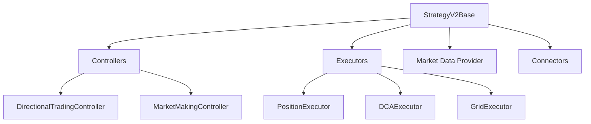

## Introduction

Hummingbot provides powerful frameworks for developing custom trading strategies. Whether you're building simple market-making bots or complex algorithmic trading systems, Hummingbot offers flexible approaches to suit your needs.

## Development Approaches

There are three main ways to develop custom strategies in Hummingbot:

### 1. Custom Scripts

The simplest approach for beginners. Scripts extend `StrategyV2Base` and implement custom trading logic.

<CardGroup cols={2}>
  <Card title="Quick Start" icon="rocket">
    - Minimal boilerplate code
    - Direct market access
    - Ideal for simple strategies
  </Card>
  <Card title="Use Cases" icon="lightbulb">
    - Simple PMM strategies
    - Price monitoring
    - Basic arbitrage
  </Card>
</CardGroup>

### 2. Strategy V2 Framework

A modular architecture combining **Controllers** and **Executors** for complex strategies.

<Info>
The V2 framework separates strategy logic (Controllers) from order execution (Executors), enabling reusable components and easier testing.
</Info>

**Key Components:**
- **Controllers**: Implement strategy logic and generate trading signals
- **Executors**: Handle order execution, position management, and risk controls
- **RunnableBase**: Base class providing lifecycle management

### 3. Traditional Strategies

Legacy strategy format (V1) using Cython for performance-critical components.

<Warning>
V1 strategies are being phased out in favor of the more flexible V2 framework. New development should use V2 or Scripts.
</Warning>

## Architecture Overview



## Core Concepts

### RunnableBase

All V2 components inherit from `RunnableBase`, which provides:

- **Lifecycle management**: `start()`, `stop()`, status tracking
- **Control loop**: Asynchronous task execution at configurable intervals
- **Event handling**: `on_start()`, `on_stop()`, `control_task()`

See [RunnableBase source](/home/daytona/workspace/source/hummingbot/strategy_v2/runnable_base.py:10)

### Configuration

All strategies and controllers use Pydantic models for type-safe configuration:

```python
class MyStrategyConfig(StrategyV2ConfigBase):
    exchange: str = "binance_paper_trade"
    trading_pair: str = "ETH-USDT"
    order_amount: Decimal = Decimal("0.01")
```

### Market Data

Access real-time market data through:
- **Connectors**: Direct exchange integration
- **Candles Feed**: OHLCV candlestick data
- **Market Data Provider**: Unified data access layer

## Development Workflow

<Steps>
  <Step title="Choose Your Approach">
    Start with Scripts for simple strategies, or use V2 framework for complex logic
  </Step>
  <Step title="Implement Configuration">
    Define Pydantic config models with your strategy parameters
  </Step>
  <Step title="Write Strategy Logic">
    Implement `on_tick()` for Scripts or `determine_executor_actions()` for Controllers
  </Step>
  <Step title="Test with Backtesting">
    Use the backtesting engine to validate your strategy with historical data
  </Step>
  <Step title="Paper Trade">
    Test on paper trading exchanges before going live
  </Step>
  <Step title="Deploy Live">
    Configure with real exchange credentials and start trading
  </Step>
</Steps>

## Next Steps

<CardGroup cols={2}>
  <Card title="Custom Scripts" icon="code" href="/development/custom-scripts">
    Learn to build simple strategies with minimal code
  </Card>
  <Card title="Strategy V2 Framework" icon="layer-group" href="/development/strategy-v2">
    Explore the modular V2 architecture
  </Card>
  <Card title="Controllers" icon="gamepad" href="/development/controllers">
    Implement strategy logic with Controllers
  </Card>
  <Card title="Executors" icon="play" href="/development/executors">
    Manage order execution and positions
  </Card>
</CardGroup>

## Resources

- [Hummingbot Foundation Discord](https://discord.gg/hummingbot) - Get help from the community
- [GitHub Repository](https://github.com/hummingbot/hummingbot) - Browse source code and examples
- [BotCamp](https://www.botcamp.xyz/) - Interactive training program for strategy developers