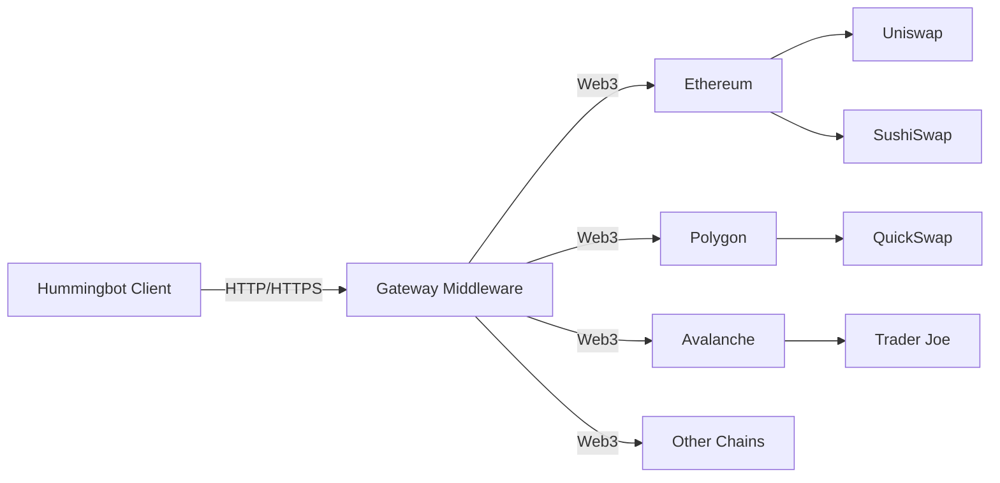

Gateway is a TypeScript-based API middleware that provides standardized connectors for interacting with Automated Market Maker (AMM) decentralized exchanges (DEXs) across different blockchain networks.

## What is Gateway?

Gateway serves as a bridge between Hummingbot and blockchain-based DEXs, enabling you to:

- Trade on AMM DEXs without writing blockchain-specific code
- Access multiple blockchain networks through a unified API
- Interact with different DEX protocols using standardized methods
- Execute swaps and manage liquidity positions across chains

## Architecture

Gateway acts as a separate service that runs alongside Hummingbot:

## DEX Connector Types

Gateway supports three types of AMM DEX connectors:

<CardGroup cols={3}>
  <Card title="Router" icon="route">
    DEX aggregators that find optimal swap routes across multiple liquidity pools.
    
    **Examples:** Uniswap Router, 0x Protocol, Jupiter
  </Card>
  
  <Card title="AMM" icon="water">
    Traditional constant product (x*y=k) liquidity pools.
    
    **Examples:** SushiSwap, PancakeSwap, Trader Joe
  </Card>
  
  <Card title="CLMM" icon="chart-simple">
    Concentrated Liquidity Market Makers with custom price ranges.
    
    **Examples:** Uniswap V3, Raydium CLMM, Meteora
  </Card>
</CardGroup>

## Key Features

### Unified API Interface

Gateway provides a consistent API regardless of the underlying blockchain or DEX protocol:

- **Swap operations**: Execute token swaps across different DEXs
- **Liquidity management**: Add and remove liquidity from pools
- **Price queries**: Get real-time pricing information
- **Balance checking**: Query wallet balances across chains

### Non-Custodial Trading

All transactions are executed directly from your wallet:

- You maintain full control of your private keys
- No need to deposit funds to an exchange
- Direct interaction with smart contracts

### Multi-Chain Support

Access multiple blockchain networks through a single interface, including:

- EVM-compatible chains (Ethereum, Polygon, BSC, Avalanche, etc.)
- Solana
- And more (see [Supported Chains](/gateway/supported-chains))

## Use Cases

<AccordionGroup>
  <Accordion title="Cross-DEX Arbitrage">
    Execute arbitrage strategies between different DEXs on the same chain or across multiple chains.
  </Accordion>
  
  <Accordion title="Liquidity Provision">
    Automate liquidity provision and management across multiple AMM pools.
  </Accordion>
  
  <Accordion title="Market Making">
    Run market making strategies on AMM DEXs using the AMM Arbitrage strategy.
  </Accordion>
  
  <Accordion title="Portfolio Rebalancing">
    Automatically rebalance token holdings across different chains and protocols.
  </Accordion>
</AccordionGroup>

## Gateway vs Direct Integration

Gateway is specifically designed for AMM DEX connectors. Here's how it differs from other connector types:

| Feature | Gateway (AMM DEX) | CLOB DEX | CLOB CEX |
|---------|-------------------|----------|----------|
| **Custody** | Non-custodial | Non-custodial | Custodial |
| **Connection** | Wallet keys via Gateway | Wallet keys direct | API keys |
| **Order Book** | No (uses liquidity pools) | Yes (on-chain) | Yes (centralized) |
| **Middleware** | Required | Not required | Not required |
| **Examples** | Uniswap, PancakeSwap | dYdX, Hyperliquid | Binance, OKX |

<Note>
CLOB DEX connectors (like dYdX or Hyperliquid) connect directly to Hummingbot without Gateway, as they use order book-based trading similar to centralized exchanges.
</Note>

## How Gateway Works

<Steps>
  <Step title="Request Initiated">
    Hummingbot sends a trading request to Gateway via HTTP/HTTPS API.
  </Step>
  
  <Step title="Transaction Preparation">
    Gateway formats the request into a blockchain transaction and estimates gas fees.
  </Step>
  
  <Step title="Transaction Signing">
    The transaction is signed using your wallet's private key stored in Gateway.
  </Step>
  
  <Step title="Blockchain Submission">
    Gateway submits the signed transaction to the appropriate blockchain network.
  </Step>
  
  <Step title="Confirmation">
    Gateway monitors the transaction status and returns the result to Hummingbot.
  </Step>
</Steps>

## Security Considerations

<Warning>
Gateway stores your wallet private keys. By default, it runs in development mode with unencrypted HTTP endpoints. For production use, always enable HTTPS mode with certificate-based authentication.
</Warning>

See [Configuration](/gateway/configuration) for details on running Gateway securely in production.

## Next Steps

<CardGroup cols={2}>
  <Card title="Installation" icon="download" href="/gateway/installation">
    Set up Gateway with Hummingbot
  </Card>
  
  <Card title="Configuration" icon="gear" href="/gateway/configuration">
    Configure Gateway for production use
  </Card>
  
  <Card title="Supported Chains" icon="link" href="/gateway/supported-chains">
    View all supported blockchains and DEXs
  </Card>
  
  <Card title="AMM DEX Connectors" icon="arrow-right-arrow-left" href="/connectors/amm-dex">
    Learn about AMM DEX connector strategies
  </Card>
</CardGroup>